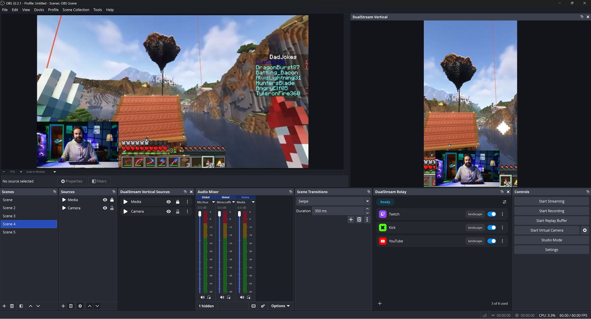

# DualStream Relay for OBS



Go live on Twitch, YouTube, Kick and more at the same time, without your
computer having to upload a separate stream to each one.

> This is a third-party plugin from Dual Stream Studio Inc. It is not part of
> OBS Studio, and it is not developed, endorsed or supported by the OBS
> Project.

Normally, streaming to three platforms at once means uploading your video
three times over. Most home internet connections cannot manage that. This
plugin sends your video once, to DualStream, and DualStream passes it on to
every platform you have turned on. Your upload stays the same whether you
are live on one platform or six.

It also covers you when your internet drops. Instead of your viewers seeing
the stream cut out, your platforms stay live showing a standby screen you
have set up, and your stream picks up where it left off once you reconnect.

You keep using OBS exactly as you do today. There is no second Start button
to learn. You press Start Streaming like always, and the plugin quietly
points that stream at DualStream instead of a single platform.

You need a DualStream account to use it. See
[dualstream.gg/relay](https://dualstream.gg/relay).

## What you need

- A Windows PC
- OBS Studio version 31.1 or newer
- A DualStream account

**Windows only for now.** macOS and Linux are not supported yet. The code is
written to run on them and the build system covers them, but no working
macOS or Linux build has been produced, so we are not going to claim it
works. That is being sorted out.

## Installing it

1. Go to the
   [releases page](https://github.com/DualStream/DualStream-Relay/releases)
   and download the file ending in `-windows-x64.zip`.
2. Close OBS if it is open.
3. Right-click the downloaded file and choose **Extract All**.
4. Open the extracted folder. Inside is one folder called
   `obs-dualstream-relay`.
5. Press **Windows key + R**, type `%ProgramData%\obs-studio\plugins` and
   press Enter.
6. Copy the `obs-dualstream-relay` folder from step 4 into that window. If
   Windows asks, replace the files already there.
7. Open OBS again.

When it is in the right place, the file
`%ProgramData%\obs-studio\plugins\obs-dualstream-relay\bin\64bit\obs-dualstream-relay.dll`
exists. A panel called **DualStream Relay** appears the first time. If you
ever close it and want it back, look under the **Docks** menu at the top of
OBS, or under **Tools**.

**Updating.** Same steps; replacing the files is the update. If OBS keeps
showing an older version afterwards, an old copy is loading from OBS's own
folder: delete `C:\Program Files\obs-studio\obs-plugins\64bit\obs-dualstream-relay.dll`
and the folder `C:\Program Files\obs-studio\data\obs-plugins\obs-dualstream-relay`
if they exist, then start OBS again. If OBS was installed somewhere else,
through Steam for example, look inside that OBS folder instead: right-click
the OBS shortcut, choose **Open file location**, and go up to the folder
that holds `obs-plugins`. The OBS log line
`[obs-dualstream-relay] plugin loaded successfully (version ...)` says which
version is running.

## Using it for the first time

1. In the DualStream Relay panel, press **Sign in**. Your web browser opens
   and shows you a short code. Approve it there. The panel updates on its
   own once you are done.
2. Press the **+** button at the bottom of the panel to add somewhere to
   stream to. Platforms you have already connected to your DualStream
   account are one click. Anything else takes a server address and a stream
   key, which that platform gives you.
3. Press **Start Streaming** in OBS, the same button you always use.

The panel shows each platform going live one by one while you stream. If a
platform refuses the stream, the panel shows you the reason in plain words.

## What it does

**One upload, every platform.** Adding a fourth or fifth platform does not
cost you any extra upload speed.

**Stays live when your internet drops.** Your platforms keep showing your
standby screen instead of ending the stream, and the panel counts down how
long you have to reconnect.

**Turn platforms on and off mid-stream.** Flip a switch and that platform
joins or leaves within a few seconds. You do not have to stop streaming. It
asks you to confirm first, so a stray click cannot knock a platform offline.

**Live status for every platform**, including the exact error a platform
gave if it turned the stream away.

**A mobile version of your scenes.** For TikTok, Reels and YouTube Shorts,
which want a tall video rather than a wide one. Turn on Mobile and you get a
tall counterpart of every scene. It shares the same cameras and sources as
your desktop scenes, but you arrange them separately, and you choose which
ones show up and which are heard. It is sent alongside your desktop stream,
not instead of it.

**Twitch on desktop and mobile at once.** With Mobile on, set your Twitch
destination to dual format and Twitch gets your desktop stream and your
mobile one in the same broadcast, so viewers holding a phone upright see the
mobile one. Every version Twitch asks for is encoded on your machine and
sent on the one connection you already have to DualStream.

**You never type your password into OBS.** Signing in happens in your
browser.

## What gets saved on your computer

Everything below lives in the plugin's own folder inside your OBS settings,
which only your Windows account can read.

**Your sign-in.** Saved when you sign in so you do not have to sign in every
time you open OBS. Deleted when you sign out. Windows encrypts it and ties
it to your Windows account, so another account on the same PC cannot read
it.

**Server addresses and stream keys** for any custom platform you added by
hand. Saved only so the edit screen can show you what a destination is
currently set to. DualStream is the real home for these. Encrypted the same
way, deleted when you remove that destination, and wiped completely when you
sign out.

**Your previous streaming settings.** When the plugin points OBS at the
relay, it first saves what your stream output pointed at before, so
"Restore previous settings" can always take you back. That saved copy can
include the stream key you had set, so it is encrypted the same way, and it
is deleted when you restore.

Nothing else is saved, and nothing is sent anywhere except to DualStream.

## For developers

Built with the OBS plugin template build system. You need CMake 3.28 or
newer.

```
cmake --preset windows-x64
cmake --build --preset windows-x64
```

Dependencies (OBS sources, prebuilt libraries and Qt) download automatically,
pinned in `buildspec.json`. The `macos` and `ubuntu-x86_64` presets exist and
are configured, but are not currently producing working builds.

Contributions are welcome. Before your first commit, install the pre-commit
hook so the repository checks run on your machine:

```
cp tools/hooks/pre-commit .git/hooks/pre-commit
```

The same checks run automatically on every pull request.

## Credits

Built on [OBS Studio](https://obsproject.com) and started from the
[OBS plugin template](https://github.com/obsproject/obs-plugintemplate).
Thanks to the OBS Project and its contributors for the platform and the
tooling that make plugins like this one possible. Being built on OBS Studio
does not make this plugin part of it: DualStream Relay is developed
independently, and the OBS Project neither endorses nor supports it.

Two files are copied unchanged from OBS Studio, so the mobile preview draws
its out-of-bounds shading and spacing guides exactly the way the main OBS
preview does: `data/images/overflow.png` and
`data/effects/striped-line.effect`. They are Copyright (C) OBS Studio
contributors, GPL-2.0-or-later, and are used here under the same license as
the rest of this project. The build also carries a copy of OBS Studio's
`cmake/finders/FindLibsrt.cmake`, with one addition so it finds the SRT
headers where the prebuilt dependencies keep them, under the same terms.

## Trademarks

The platform logos in `data/images/platform/` are the trademarks of their
respective owners. They are included only to show which platform each row in
the panel sends to, following each platform's own brand guidelines. They are
not covered by this project's license, and including them does not imply any
endorsement, sponsorship or affiliation.

## License

GPL-2.0-or-later. See [LICENSE](LICENSE). The exception is the platform
artwork noted above, which remains the property of its respective owners.
